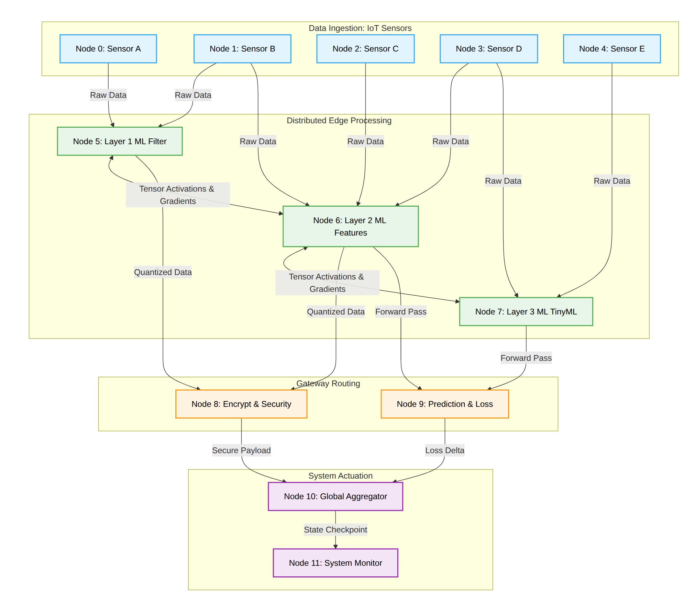
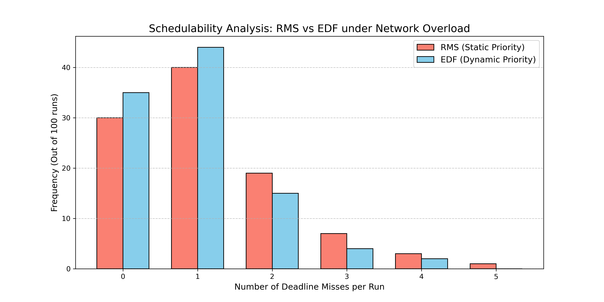
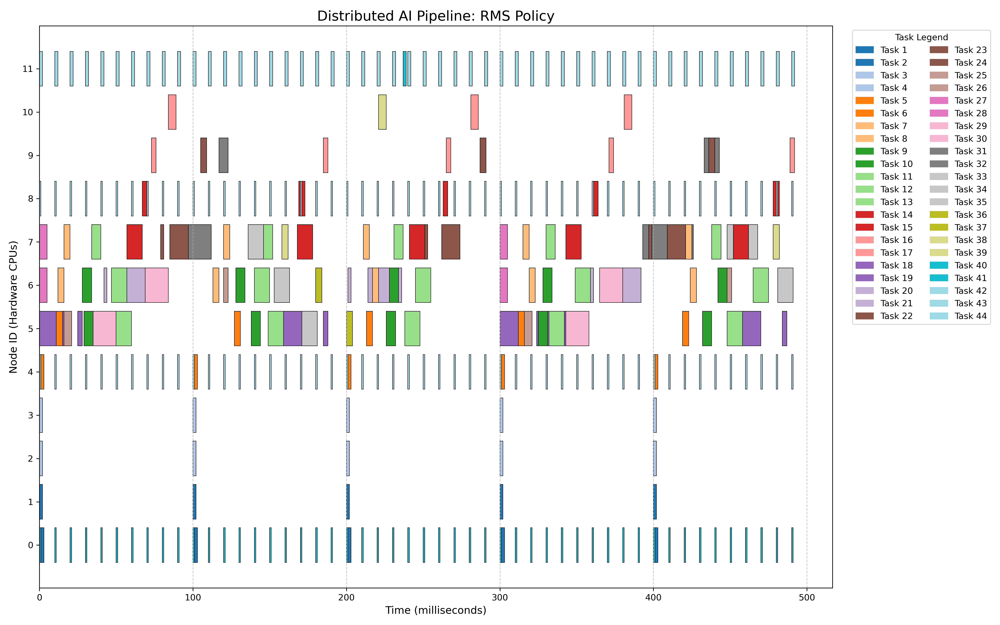
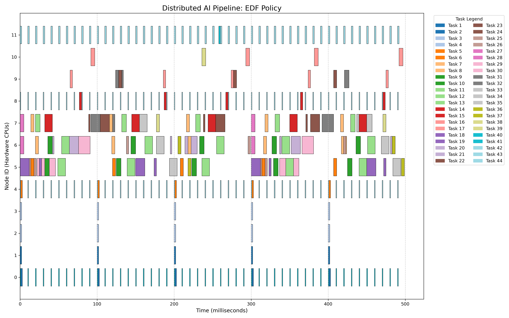

# D-RTSS: Distributed Real-Time Scheduling Simulator

## Overview

**D-RTSS** is a C++ discrete-event timing simulator designed for **Mathematical Schedulability Analysis** of Cyber-Physical Systems (CPS) and Distributed Edge AI pipelines.

Rather than executing live workloads, this engine mathematically models CPU context-switching, mixed-criticality preemption, memory (RAM) bottlenecks, and stochastic network delays. It is used to validate system architectures, analyze Worst-Case Response Times (WCRT), and prove Directed Acyclic Graph (DAG) schedulability under strict real-time constraints.

---

## Distributed Split-AI Pipeline Topology

The simulator executes a 12-node hardware topology, mapping Edge Sensors to Gateway ML accelerators based on a Split-Computing architecture.


---

## Visual Analytics & Interpretations

### 1. System Architecture Profiling
The Python telemetry pipeline processes the generated `trace.csv` logs to extract raw CPU utilization and critical path latency. 

**Actual CPU Utilization (Bottleneck Analysis):**
* **Nodes 0-4 (Edge Sensors):** Highly efficient, hovering between ~2.0% and ~12.2% utilization.
* **Nodes 5-7 (Gateway ML Layers):** The primary system bottlenecks, sustaining **~42.1% to ~45.7% utilization**. 
* *Insight:* This data proves that concurrent execution of ML tasks and system interrupts on Gateway nodes requires strict RAM partitioning (256KB) to avoid CPU starvation.

**Critical Path Latency (Task 1 -> Task 17):**
* **RMS Latency Penalty:** 53ms of system overhead/jitter (88ms actual vs. ~35ms theoretical minimum).
* **EDF Latency Penalty:** 61ms of system overhead/jitter (96ms actual vs. ~35ms theoretical minimum).
* *Insight:* RMS maintains a slightly faster critical path on successful runs, but EDF sacrifices this minor latency difference to dynamically save more system-wide deadlines across the entire DAG.

### 2. Dual-Policy Monte Carlo Analysis
Executing the simulator across 100 stochastic epochs ($\mu=5.0ms$, $\sigma=3.0ms$) mathematically tests system resilience against network jitter. 

**Failure Probability Results:**
* **RMS Failure Probability:** 70.0%
* **EDF Failure Probability:** 65.0%



> **Interpretation:** While both policies struggle under extreme network overload, EDF's dynamic priority queuing clusters its failures closer to zero. It successfully curtails the "tail latency" severity that plagues static RMS execution, reducing the overall failure rate by 5%.

### 3. Execution Gantt Charts
These generated trace charts visualize exact OS-level preemption dynamics across the 12-node cluster.

**Rate Monotonic Scheduling (RMS):**



**Earliest Deadline First (EDF):**



> **Interpretation:** The periodic, high-priority 10ms hardware interrupts (teal bars on nodes 0, 4, 8, 11) forcefully and cleanly preempt larger ML workloads. The visual fragmentation differences highlight how EDF dynamically reprioritizes the `READY` queues as network-delayed packets arrive closer to their absolute deadlines, contrasting with the rigid periods observed in RMS.
---

## Key Architectural Insights Discovered

Through dual-policy simulation (RMS vs. EDF) and Monte Carlo network analysis, this simulator mathematically proved the following:

1. **EDF Superiority under Overload:** Earliest Deadline First (EDF) dynamic queuing successfully reduced system failures during heavy network congestion. Under 100 epochs of stress testing, Rate Monotonic Scheduling (RMS) suffered a **70.0% failure probability**, whereas EDF reduced this to **65.0%**.
2. **Critical Path Latency Trade-offs:** Profiling revealed that RMS had a lower critical path latency penalty (53ms) compared to EDF (61ms). However, EDF traded this slight latency increase on the main path to dynamically save more system-wide deadlines, leading to its lower overall failure probability.
3. **Memory Over-Subscription:** Modeled Gateway node RAM constraints (256KB capacity), proving that concurrent execution of Layer 2 ML tasks and 10ms network interrupts requires strict memory partitioning to avoid CPU starvation. Nodes 5, 6, and 7 were identified as the primary hardware bottlenecks, sustaining over **42-45% CPU utilization** compared to <13% on Edge Sensors.
4. **Priority Inversion Safety:** Successfully validated that priority scheduling strictly protects 10ms safety-critical hardware interrupts against 300ms neural network backpropagation tasks without triggering system faults.

---

## Core Features

* **Discrete-Event Engine:** Millisecond-accurate simulated clock avoiding OS-level hardware timer overhead.
* **Mixed-Criticality Support:** Safely models overlapping periods (e.g., 10ms hardware interrupts preempting 300ms AI tasks).
* **Memory (RAM) Management:** Simulates memory bottlenecks where highest-priority tasks are blocked if node RAM is exhausted.
* **Stochastic Network Calculus:** Replaces fixed network delays with Gaussian (Normal) distribution models to simulate real-world IoT wireless jitter.
* **Python Telemetry Pipeline:** Ingests C++ `trace.csv` logs to generate system-wide Gantt charts and Monte Carlo probability density functions.

---

## Getting Started

### 1. Build and Run the C++ Simulator

```bash
mkdir build && cd build
cmake ..
make
./simulator

```

### 2. Run the Python Analytics

From the root project directory, run the analytical tools to process the generated trace files:

```bash
# Generate the Critical Path and CPU Profiling output
python3 analyze_trace.py

# Generate Visual Gantt Charts (.png)
python3 draw_gantt.py

# Run Dual-Policy Monte Carlo Analysis
python3 compare_policies.py

```

```

```